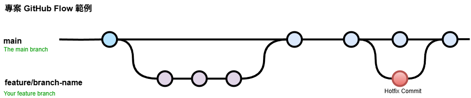

# Convention

## 專案流程

採用 GitHub Flow



## Branch Naming Convention

```plain text
<類型>/<分支名稱>
```

- 以英文半形小寫命名。名稱需要連接多個單字時以 `-` 連接。
- 舉例: feature/add-index-page

|   type   |        description         |
| :------: | :------------------------: |
| feature  |       功能、需求相關       |
|   fix    |     bug 修正、調整相關     |
|   docs   |          文件相關          |
|   test   | 測試相關(目前應該不會用到) |
| refactor |            重構            |
|  chore   |            雜項            |

## Commit Message Convention

```plain text
<類型>[可選的作用範圍]: <描述>
```

- 以英文半形小寫，或中文進行撰寫。
- scope: 選填。自行描述即可。
- 舉例: fix(style): 修正bootstrap變數設定

```plain text
✔️ feat: add about page
✔️ fix(html): 將文章列表區塊調整成符合語意化
❌ 調整間距 (沒有符合規範 + 太簡略)
```

|   type   |        description         |
| :------: | :------------------------: |
|   feat   |       功能、需求相關       |
|   fix    |     bug 修正、調整相關     |
|   docs   |          文件相關          |
|   test   | 測試相關(目前應該不會用到) |
| refactor |            重構            |
|  chore   |            雜項            |

More Details: [Conventional Commits](https://www.conventionalcommits.org/zh-hant/v1.0.0/)
